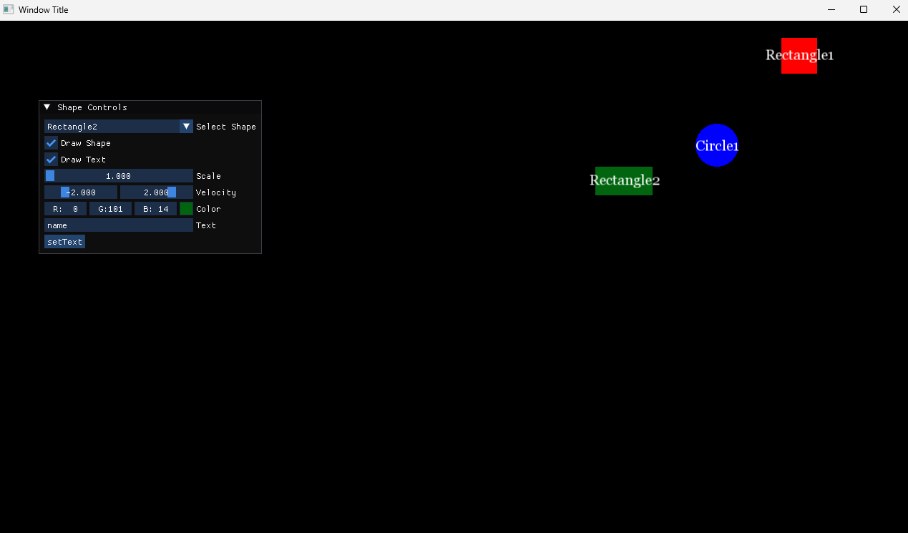

# Hello_SFML_and_Gui
A simple project where I met ImGui and SFML. 

You can interact with the figures by changing their color, text on them, size and velocity. Shapes "bounce" off the sides of the window which contain them. You can select shape from list of shapes. 

Project needs config file, you can find example in project`s files. (shapes.txt)

Example of interface:

